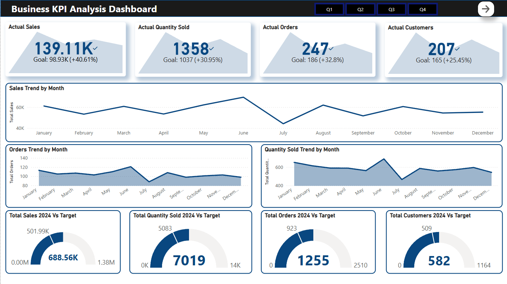
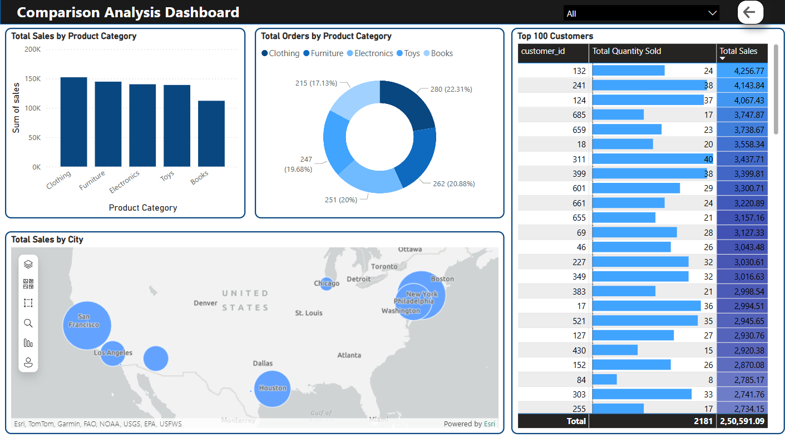

# 🛍️ Sales Data Comparison & Analysis (2023–2024)

A complete end-to-end data generation, cleaning, and visualization project comparing two business years (2023 vs 2024) through custom synthetic data. Built entirely in Python (Jupyter Notebook) and visualized using Power BI — combining storytelling with interactivity using dynamic slicers, maps, and custom tooltips.

---

## 🛠️ Tools & Technologies Used

- **Python (pandas, Faker, NumPy)** – Generated and cleaned 2023 & 2024 datasets using random logic and libraries.
- **Power BI** – Designed interactive dashboards with city/state maps, slicers, donut charts, KPI cards, tooltips, and bar graphs.
- **Generative AI (ChatGPT)** – Used as a co-pilot to debug scripts, organize logic, rewrite markdown, and brainstorm layout/design enhancements.

---

## 👤 Author

**Chirag Suri**  
_Always curious with data, a fan of combining visuals with meaningful insights._

- GitHub: [Link](https://github.com/Chiragsuri)
- LinkedIn: [Link](https://www.linkedin.com/in/chirag-suri/)
- Portfolio: [Link](https://chiragsuri.github.io)

---

## 📁 Dataset Description

This project doesn’t use real-world business sales data. Instead:

🔹 I first **generated synthetic sales data** for 2023 and 2024 using Python’s Faker and NumPy libraries.  
🔹 Then saved them into two datasets:

- [`Sales_data_2023.csv`](Datasets/sales_data_2023.csv)  
- [`Sales_data_2024.csv`](Datasets/sales_data_2024.csv)

---

## 🎯 Problem Statements / Goals

While most people look at just total revenue per year, this project dives deeper into:

- 🛒 Are certain product categories more dominant by sales or by total orders?
- 🏙️ Which cities contributed the most to overall revenue?
- 📈 How do trends change month-by-month across KPIs like Sales, Orders, Quantity Sold?
- 👤 Who are the top customers and how much are they contributing to our growth?
- 🧭 What is the business growth direction comparing 2023 and 2024?

These questions often get ignored in surface-level reports — this project is about answering them clearly and interactively.

---

## 🔄 Project Workflow

### 🐍 Python (Jupyter Notebook)

- Used `Faker`, `random`, and `NumPy` to simulate customer/product/order behaviour.
- Created two different logic blocks — one for 2023 and another for 2024 (with product-category mappings, customer/product ID formatting, etc.)
- Ensured consistent column names, formats, and realistic date ranges.
- Final output was saved as `.csv` files to be imported into Power BI.

➡️ _Notebook: [`SalesDataset.ipynb`](Python/SalesDataset.ipynb)_

---

### 📊 Power BI Dashboard

This dashboard combines a clean layout with multiple pages to show different stories across product, region, and customer KPIs.

#### 📄 Page 1: KPI Dashboard

- 📌 KPI cards: Actual sales, quantity sold, orders, customers
- 📈 Line charts: Month-wise sales and orders
- 🎯 Gauge charts: Year-end vs target metrics (sales, orders, customers)

#### 📄 Page 2: Comparison Analysis

- 📊 Total sales by product category (bar chart)
- 🧮 Total orders by product category (donut)
- 🗺️ Total sales by city (map view)
- 🧑 Top 100 customers (ranked by sales & quantity sold)

#### 📄 Page 3: Custom Tooltip View

- This view appears as a tooltip when users hover over visuals (e.g., sales chart).
- Designed as a **Qtr-wise breakdown** of all KPIs.

---

## 💡 Key Insights

- 📈 2024 saw a significant increase in both total customers and total sales.
- 📚 Categories like **Clothing** and **Electronics** were the most ordered and highest selling.
- 🗺️ Cities like **San Francisco**, **New York**, and **Houston** led the sales map.
- 💎 Top 100 customers accounted for over **60%** of the total sales.
- 🎯 Almost every metric beat its original yearly target.

---

## 🚀 Things I Learned

- How to create **realistic synthetic datasets** with controlled randomness.
- Clean structuring of logic blocks across multiple simulated datasets.
- Setting up well-formatted data to be dashboard-ready.
- Designing **Power BI dashboards that are interactive, not overwhelming**.
- Leveraging **Generative AI** to write cleaner markdowns, handle exceptions, and make quick adjustments in logic.

---

## 📦 How to Explore This Project

1. 📥 Download both sales datasets from the repo folder (`Dataset/`)
2. 🐍 Run the Python notebook to understand the data generation logic.
3. 📊 Open the Power BI `.pbix` file and explore dashboards/slicers/tooltips.
4. 🧭 Use custom slicers to filter per category, city, or customer and watch visuals change dynamically.

➡️ _Power BI File: [`Sales_Data_Dashboard.pbix`](Dashboard/Sales_Data_Dashboard.pbix)_  
🖼️ Published version: [*Add Power BI service link here*]

---

## THANK YOU 🙌
